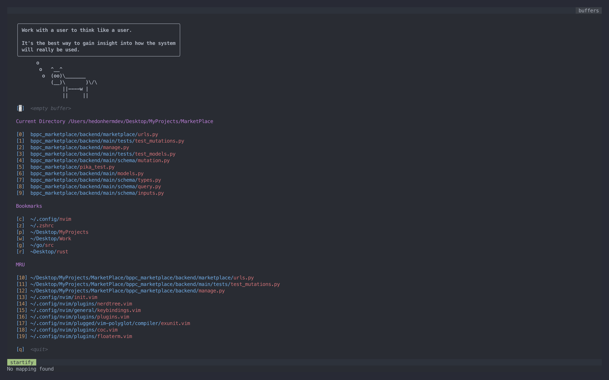
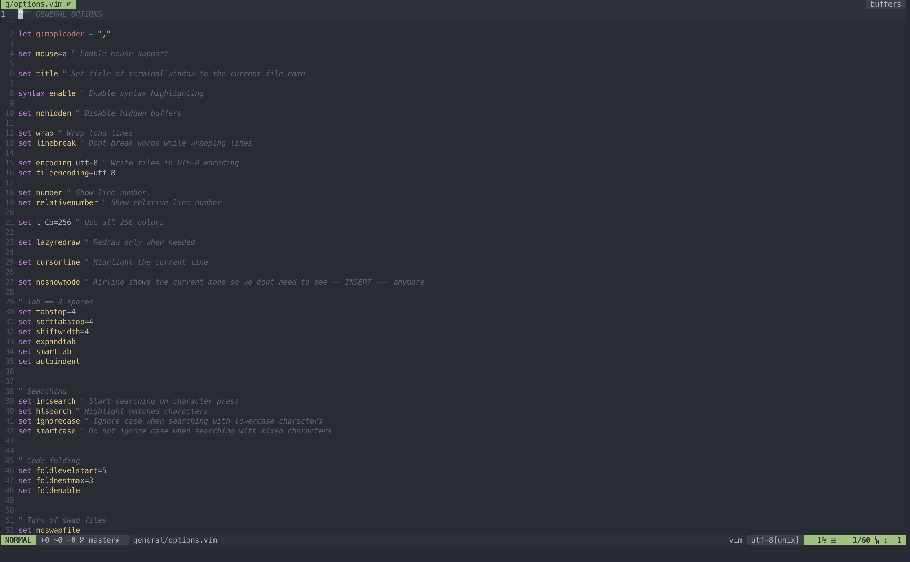
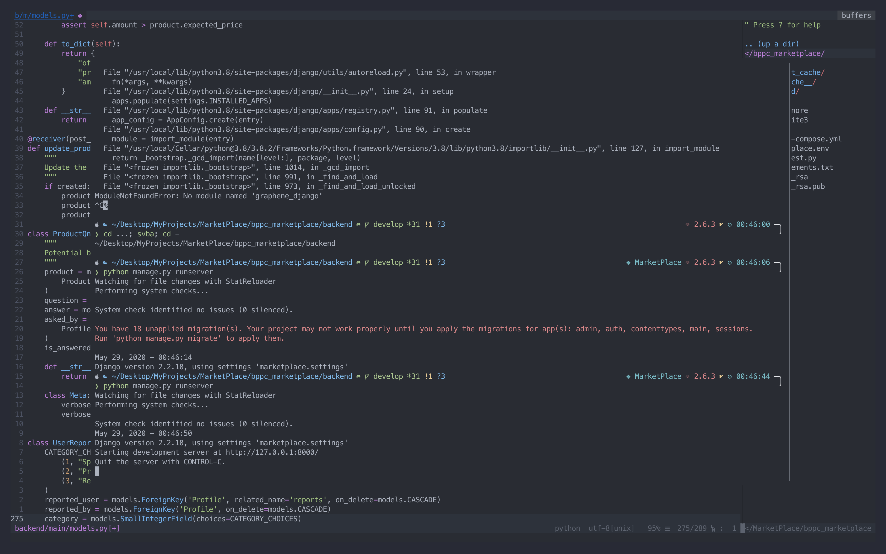
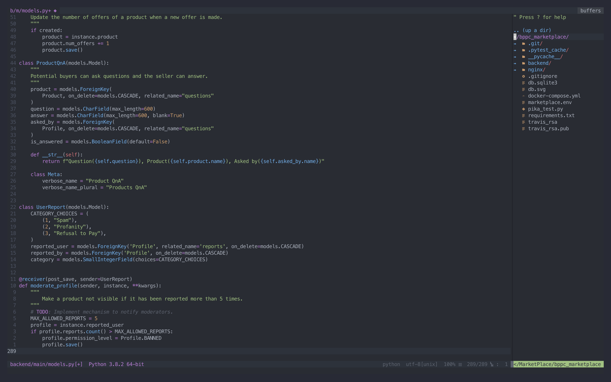
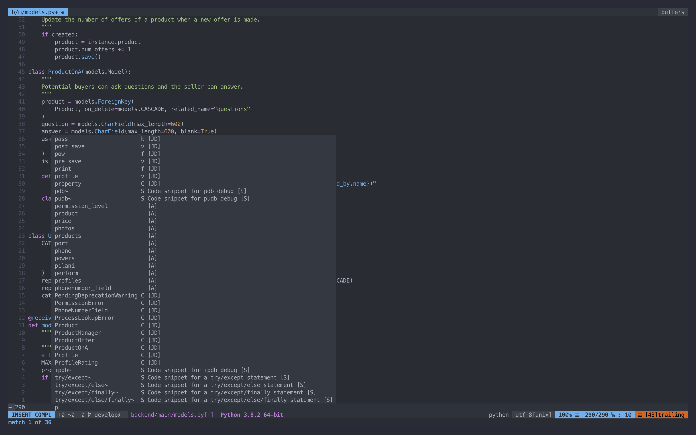

# My NeoVim configuration

This is the exact configuration I use to make NeoVim hella awesome for me to use.

Features:

-   Syntax
-   Sane keybindings
-   Pretty UI
-   Airline + Tabline
-   Pretty Start up screen
-   File explorer
-   FZF
-   Ranger
-   Floating Terminal
-   Autocomplete using Language servers
-   Autoformat on file save
-   Git integration
-   Spellcheck for markdown files
-   Bunch of plugins for functionality like vim-surround, vim-repeat, etc.
-   Silver Searcher to search through files

# Screenshots

